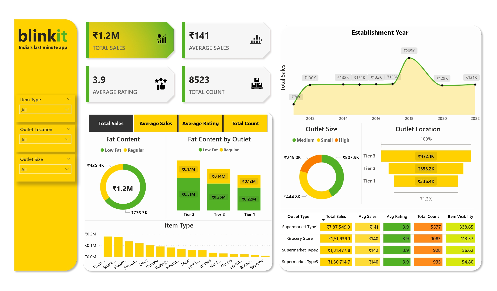

### Summary format for the Blinkit Dashboard:
- The Blinkit Dashboard offers a detailed view of sales performance for Blinkit, India's last-minute delivery app. The dashboard reports total sales of ₹1.2M, with an average sales value of ₹141 and an average customer rating of 3.9 across 8,523 transactions. It breaks down sales by fat content, showing ₹776.3K from low-fat items and ₹425.4K from regular fat items. The sales are further analyzed by outlet tier, with Tier 3 outlets leading at ₹0.31M, followed by Tier 2 and Tier 1 outlets. The dashboard also provides insights into sales by item type, with categories like fruits, snacks, and household items being highlighted. Additionally, sales data is segmented by establishment year, showing consistent sales from 2012 to 2022, and by outlet size, with medium-sized outlets generating the highest sales at ₹507.9K. The outlet type analysis reveals that supermarkets (Type 1) have the highest sales at ₹7,87,549.9, while grocery stores, although smaller in sales volume, maintain a steady average sales value and rating. This comprehensive dashboard effectively captures the key metrics and trends in Blinkit's sales performance.

- **Total Sales**: ₹1.2M  
- **Average Sales**: ₹141  
- **Average Rating**: 3.9 (8,523 transactions)  
- **Sales by Fat Content**: ₹776.3K (Low Fat), ₹425.4K (Regular)  
- **Sales by Outlet Tier**: ₹0.31M (Tier 3), ₹0.25M (Tier 2), ₹0.22M (Tier 1)  
- **Sales by Outlet Size**: ₹507.9K (Medium), ₹444.8K (Small), ₹249.0K (High)  
- **Top Outlet Type**: Supermarket Type 1 with ₹7,87,549.9 in sales.
